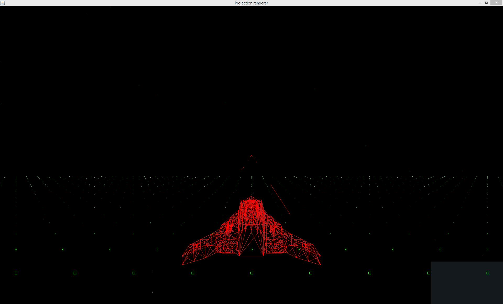

# PB3D
PB3D is an attempt at simple 3D rendering on java, without 3D acceleration

# Downloads (and) Binaries:
See the releases tab, make sure you have java installed.
# Demo controls: 
i,j,k,l to rotate
0 to switch to image-based awt rendering (supports resolution scaling)
9 to switch to standard awt rendering
a, w, d, s, q and e to move
# How to set up
-use git clone to get the source code

-make sure all the dependencies listed under the next section are present in the lib sub-directory.

-open the project in your favorite IDE, currently only netbeans configs are included.

If you do not use netbeans:

-make sure that java classpath includes the lib-directory and all of it's packages.

# Dependencies
[JFUtils](https://github.com/jonnelafin/JFUtils) (Binaries Included by Default)

[TinySound](https://github.com/finnkuusisto/TinySound) (Binaries Included by Default)

# Random Screenshots
Wireframe #1:

